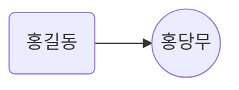

# diagramtest

```mermaid
  graph TD;
      A-->B;
      A-->C;
      B-->D;
      C-->D;
```

```mermaid
flowchart LR;
node(홍길동);
n2((홍당무));
node-->n2;
```

```mermaid
classDiagram
interface MemberService
```
