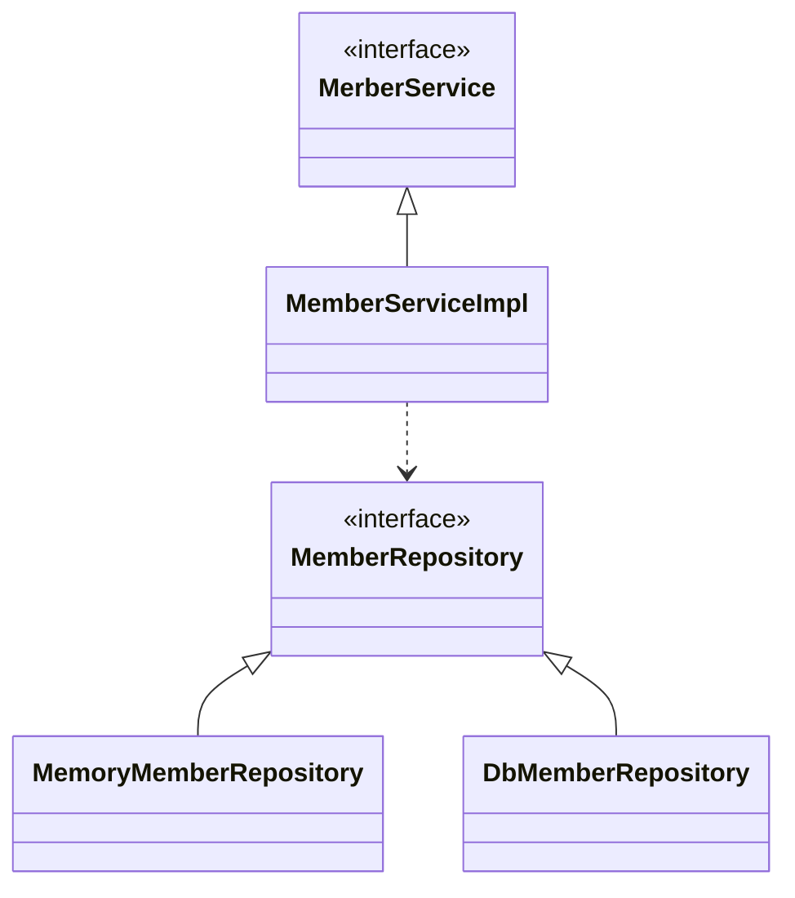

# diagramtest

```mermaid
classDiagram
class MerberService {<<interface>>}
class MemberServiceImpl
class MemberRepository {<<interface>>}
class MemoryMemberRepository
class DbMemberRepository

MemberServiceImpl..>MemberRepository
MerberService <|--MemberServiceImpl
MemberRepository <|--MemoryMemberRepository
MemberRepository <|--DbMemberRepository
```
