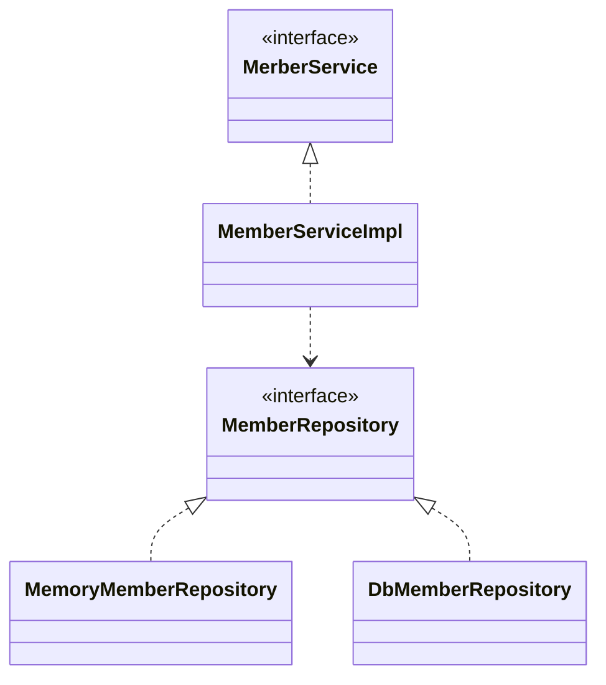
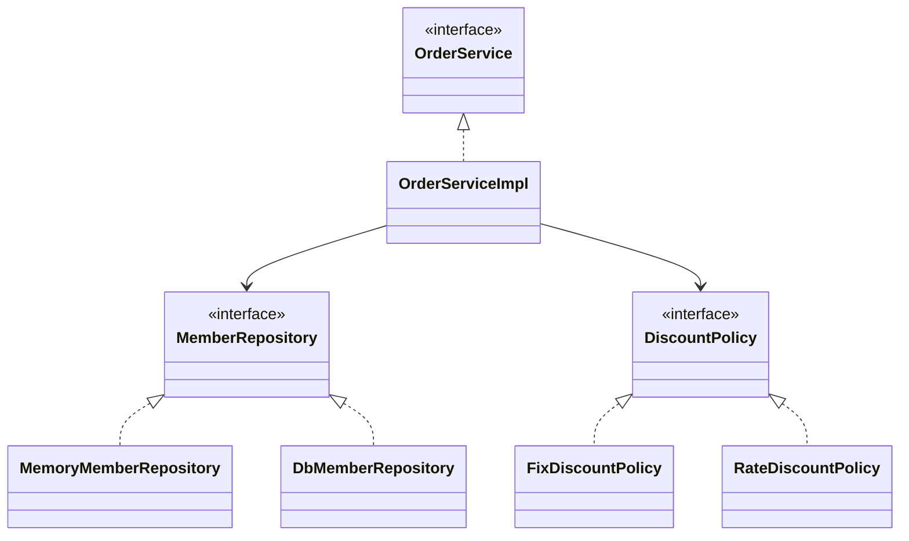

# diagramtest

```mermaid
classDiagram
class MerberService {<<interface>>}
class MemberServiceImpl
class MemberRepository {<<interface>>}
class MemoryMemberRepository
class DbMemberRepository

MemberServiceImpl..>MemberRepository
MerberService <|..MemberServiceImpl
MemberRepository <|..MemoryMemberRepository
MemberRepository <|..DbMemberRepository
```

```mermaid
classDiagram
class OrderService {<<interface>>}
class OrderServiceImpl

class MemberRepository {<<interface>>}
class MemoryMemberRepository
class DbMemberRepository

class DiscountPolicy {<<interface>>}
class FixDiscountPolicy
class RateDiscountPolicy

OrderService <|.. OrderServiceImpl
OrderServiceImpl --> MemberRepository
OrderServiceImpl --> DiscountPolicy

MemberRepository <|.. MemoryMemberRepository
MemberRepository <|.. DbMemberRepository

DiscountPolicy <|.. FixDiscountPolicy
DiscountPolicy <|.. RateDiscountPolicy
```
